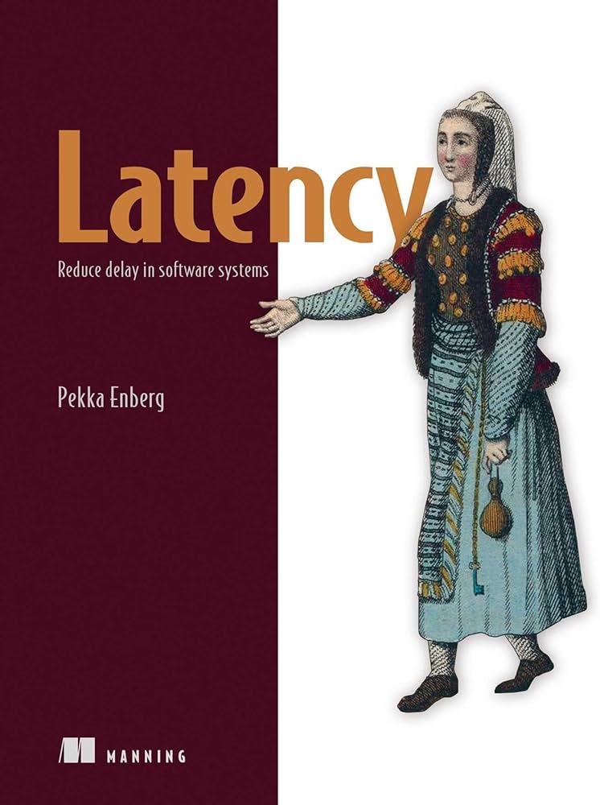

# Latency - Code Examples

This repository contains code examples and practical implementations from the book [**`Latency`**](https://www.manning.com/books/latency) by Pekka Enberg, published by Manning Publications.

Terms:
- Moore's law
- Dennard's law
- Wirth's law
- Littls's law
- Amdahl's law
- Tail latency

Used Libaries:
- tokio …
